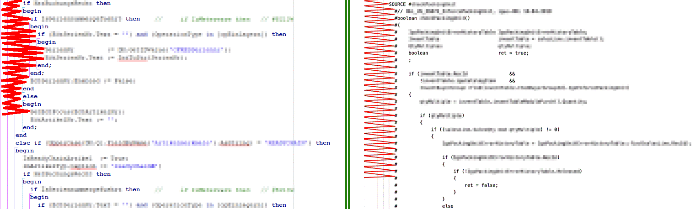
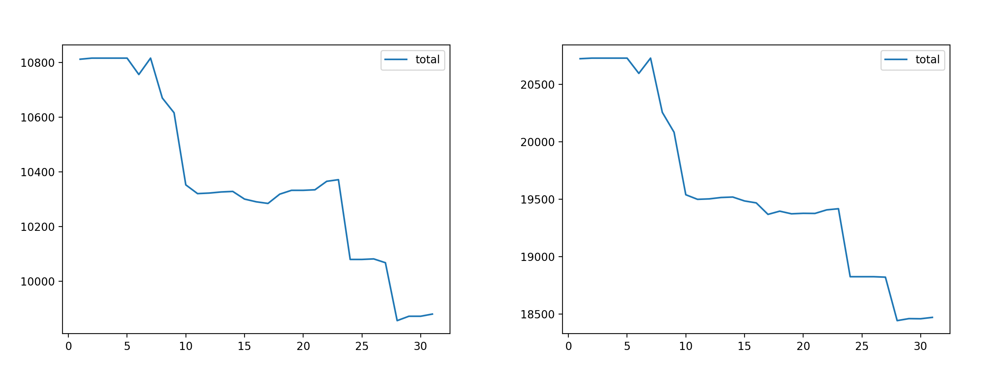
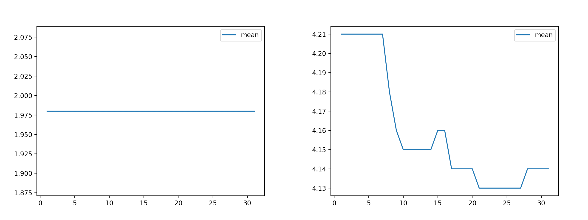
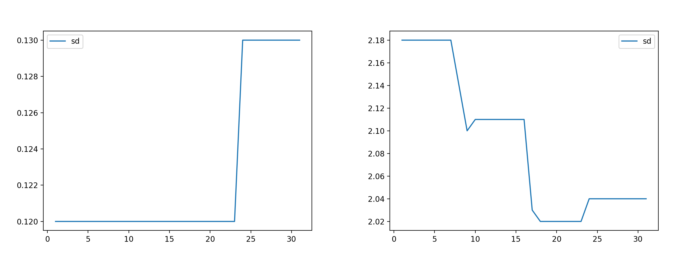

## Special Case for Complexity Calculation: Microsoft Dynamics AX 4.0

### How is X++ Code Different?

The ERP system Microsoft Dynamics AX 4.0 can be customized using the X++ programming language. The source code is kept inside the AX system, which does not provide version control. However, we can export the X++ code to `.xpo` files and put them into git.

The following figure compares Pascal to exported X++ code:

Figure 1: Comparison of Pascal (left) vs. exported X++ code (right)

### What Is the Problem?

Every source code line in an `.xpo` file starts with 8 space characters and a `#` character. As a consequence, substituting complexity by indentation shows a maximum value of `2` for X++ source code. When analyzing the trend, only added or removed lines have an impact on the measurements. The mean and standard deviation of this complexity substitute stay quite constant.

### How Is the Problem Solved?

In order to fix this issue, a **preprocessing** step removes all `#` characters which are indented by 8 space characters (see [miner.language_preprocessors](../miner/language_preprocessors.py)). Only after that, the whitespace in the source code is analyzed.

### What Is the Difference?

The following diagrams show the trends for a particular X++ `.xpo` file without the problem solution (left) and with the solution in place (right). The analyzed file contains about 5.000 lines of code - including comments.

Figure 2: Trend of total complexity without patch (left) vs. patched (right)

In the left diagram of figure 2, the maximum total value is about 10800 while it is really about 20500. Still, both diagrams show the correct total complexity trend over time for this huge file.

Figure 3: Trend of mean complexity without patch (left) vs. patched (right)

The original analysis said that the average code complexity was low (2) and stable. Actually, the code is much more complex than indicated and the team did improve the code in the past.

Figure 4: Trend of complexity standard deviation without patch (left) vs. patched (right)

Using the unmodified algorithm, the trend of the standard deviation gave a **wrong impression**:

The low values of `sd` in the left diagram of figure 4 suggest that the code complexity is distributed homogeneously in the large file. The false assumption of quite nice code was strengthened by the wrong mean value of 2 shown in figure 3.

In contrast, the true standard deviation is about 2, and it has slightly improved (decreased) in the past.
